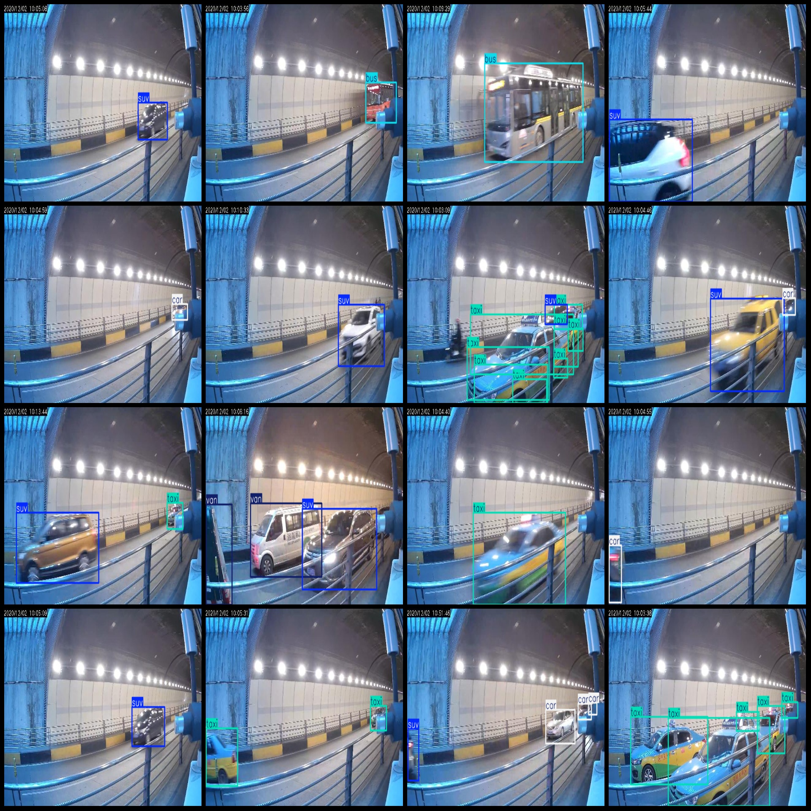
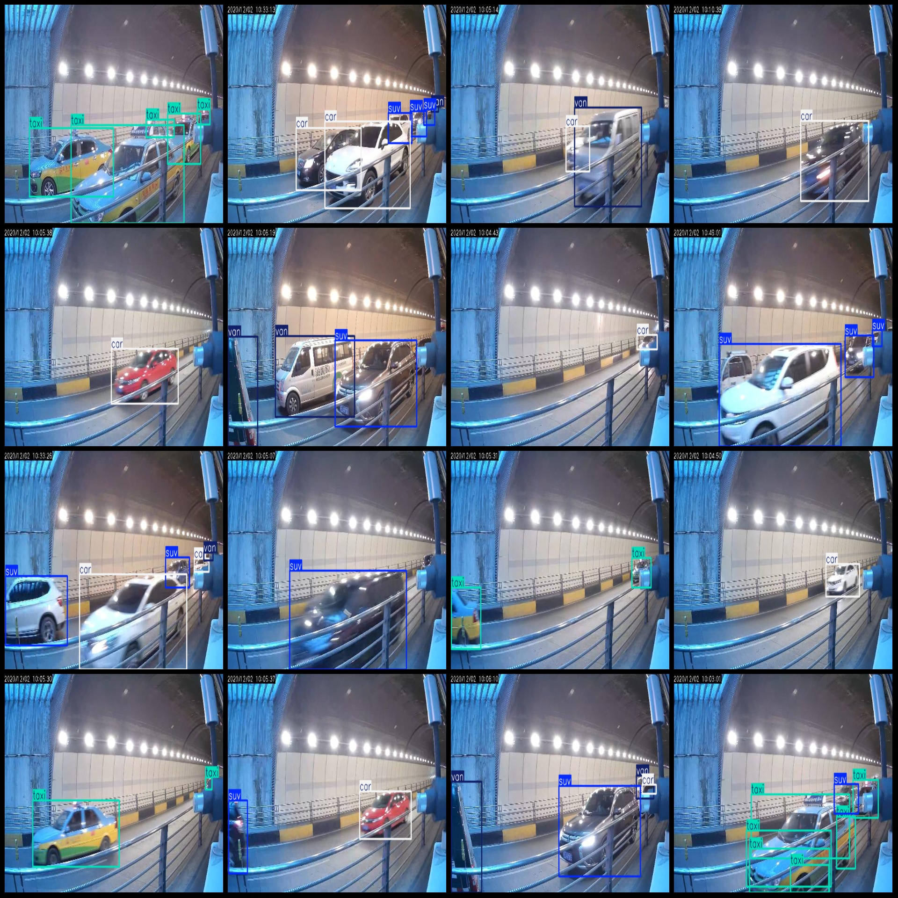

# Road Tunnel Vehicle Detection Data Set in VOC+YOLO Format with 2088 Images and 6 Categories

Dataset format: Pascal VOC format + YOLO format (txt file without split path, only containing jpg images and corresponding VOC format xml files and yolo format txt files)

Number of images (jpg file count): 2088
Number of annotations (xml file count): 2088
Number of annotations (txt file count): 2088
Number of categories: 6
Category names for annotations (note that the order of labels in the yolo format is not consistent with this, but refer to the "labels" folder's "classes.txt" for consistency): ["bus", "car", "suv", 
"taxi", "truck", "van"]

Number of bounding boxes per category:
- bus (public bus) bounding box count = 88
- car (small sedan) bounding box count = 1541
- suv (SUV) bounding box count = 1325
- taxi (taxi) bounding box count = 981
- truck (truck) bounding box count = 11
- van (van) bounding box count = 829
Total bounding box count: 4775

Number of images per category:
- bus (public bus) image count = 82
- car (small sedan) image count = 1164
- suv (SUV) image count = 1025
- taxi (taxi) image count = 550
- truck (truck) image count = 11
- van (van) image count = 523

Image resolution: 640x362

Annotation tool used: labelImg
Annotation rules: draw bounding boxes for each category

Important note: The dataset does not have separate training, validation, or test sets; you will need to create your own.
Special declaration: This dataset does not guarantee any accuracy for models trained on it or any weights/files generated from it.

Image preview:
Annotation example:
## Images

Here is a pay link on Stripe ( https://buy.stripe.com/3cs8yP7sY87d0vu9AB ). Please contact me lonlonago@foxmail.com after funding $89, and I will send you a complete data files , thank you!

